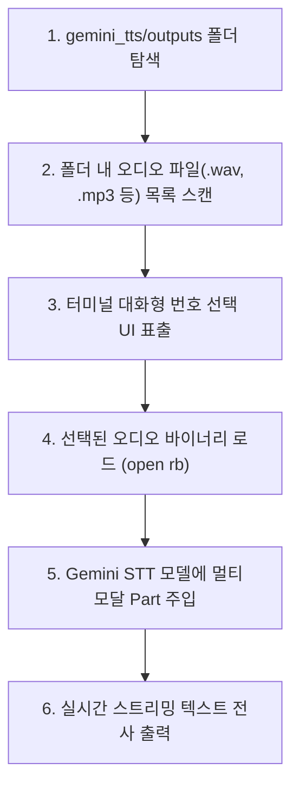

# 🎧 Gemini STT (Speech-to-Text) 코드 라인별(Line-by-Line) 완벽 해설

이 문서는 Google AI Studio의 오디오 전사 모델인 **`gemini-3.5-transcribe`**를 사용하여, **`gemini_tts/outputs/` 폴더에 생성된 오디오 파일들을 자동으로 조회하고 사용자가 선택한 파일의 음성을 실시간 텍스트로 변환(STT)**하는 [`gemini_stt.py`](gemini_stt.py)의 모든 코드를 줄 단위로 상세히 설명합니다.

---

## 📌 전체 동작 흐름 요약



---

## 🔍 Line-by-Line 상세 코드 해설

### 1행 ~ 6행: 라이브러리 임포트

```python
1: import os
2: import sys
3: # pyrefly: ignore [missing-import]
4: from google import genai
5: # pyrefly: ignore [missing-import]
6: from google.genai import types
```

* **1행 (`import os`)**: 디렉토리 경로 탐색, 파일 크기 확인, 환경변수 읽기 등을 위해 파이썬 표준 `os` 모듈을 가져옵니다.
* **2행 (`import sys`)**: 사용자가 명령행 인자로 파일 경로를 직접 넘긴 경우(`sys.argv`) 처리하기 위해 가져옵니다.
* **4~6행 (`from google import genai`, `from google.genai import types`)**: Google GenAI 최신 SDK 클라이언트 및 데이터 구조체 타입들을 로드합니다.

---

### 8행 ~ 24행: TTS 출력 폴더 자동 탐색 (`get_tts_output_dir`)

```python
8: def get_tts_output_dir() -> str:
9:     """gemini_tts/outputs 폴더 경로를 자동으로 찾아 반환합니다."""
10:     current_dir = os.path.dirname(os.path.abspath(__file__))
11:     candidates = [
12:         os.path.abspath(os.path.join(current_dir, "..", "gemini_tts", "outputs")),
13:         os.path.abspath(os.path.join(current_dir, "gemini_tts", "outputs")),
14:         os.path.abspath("gemini_tts/outputs"),
15:     ]
16:     for path in candidates:
17:         if os.path.isdir(path):
18:             return path
19:     default_path = candidates[0]
20:     os.makedirs(default_path, exist_ok=True)
21:     return default_path
```

* **8~10행**: 스크립트가 실행되는 위치(`__file__`)를 기준으로 절대 경로를 계산합니다.
* **11~15행 (`candidates`)**:
  * 사용자가 `gemini_stt/` 서브폴더 안에서 실행하든(`..`), 프로젝트 루트에서 실행하든(`current_dir`), 어떤 위치에서든 **`gemini_tts/outputs` 폴더를 정확히 찾아낼 수 있도록 3가지 후보 경로**를 탐색합니다.
* **16~21행**: 존재하는 디렉토리 경로를 반환하며, 만약 폴더가 아직 없다면 자동으로 생성한 뒤 경로를 돌려줍니다.

---

### 24행 ~ 71행: 대화형 오디오 파일 선택 UI (`select_audio_file`)

```python
24: def select_audio_file() -> str | None:
...
27:     if len(sys.argv) > 1:
28:         custom_path = sys.argv[1]
29:         if os.path.exists(custom_path):
30:             return custom_path
...
33:     tts_dir = get_tts_output_dir()
34:     supported_exts = (".wav", ".mp3", ".m4a", ".ogg", ".flac", ".aac")
35: 
36:     audio_files = [
37:         f for f in os.listdir(tts_dir)
38:         if os.path.isfile(os.path.join(tts_dir, f)) and f.lower().endswith(supported_exts)
39:     ]
40:     audio_files.sort(
41:         key=lambda f: os.path.getmtime(os.path.join(tts_dir, f)),
42:         reverse=True
43:     )
```

* **27~30행**: 사용자가 `python3 gemini_stt.py 파일경로` 형태로 직접 인자를 주면 메뉴 표출 없이 즉시 그 파일로 진행하도록 지원합니다.
* **33~35행**: TTS 출력 폴더 경로를 가져오고, 지원하는 오디오 확장자 튜플을 정의합니다.
* **36~43행**: 폴더 내 파일들을 탐색하고, **가장 최근에 생성된 파일(최신 수정 시간 역순)**이 1번으로 오도록 정렬합니다.

```python
45:     if not audio_files:
46:         print(f"\n[안내] '{tts_dir}' 폴더에 오디오 파일이 없습니다.")
...
50:     print("\n" + "=" * 65)
51:     print(f"📁 [gemini_tts/outputs] 폴더의 생성 오디오 파일 목록:")
52:     print("=" * 65)
53:     for idx, fname in enumerate(audio_files, 1):
54:         full_path = os.path.join(tts_dir, fname)
55:         size_kb = os.path.getsize(full_path) / 1024
56:         size_str = f"{size_kb / 1024:.1f} MB" if size_kb >= 1024 else f"{size_kb:.1f} KB"
57:         print(f" [{idx}] {fname:<30} ({size_str})")
58:     print("-" * 65)
```

* **45~48행**: 폴더가 비어 있는 경우 TTS 생성 스크립트를 먼저 실행하라는 친절한 안내를 출력하고 종료합니다.
* **50~58행**: 발견된 오디오 파일들의 번호, 파일명, 파일 용량(KB/MB)을 표 형태로 예쁘게 출력합니다.

```python
60:     while True:
61:         try:
62:             choice = input(f"👉 전사(STT)를 진행할 파일 번호를 선택하세요 (기본값 1): ").strip()
63:             if not choice:
64:                 selected_file = audio_files[0]
65:                 break
66:             idx = int(choice)
67:             if 1 <= idx <= len(audio_files):
68:                 selected_file = audio_files[idx - 1]
69:                 break
...
```

* **60~71행**: 사용자가 번호를 입력하거나 엔터(기본값 1번 선택)를 누르면 해당 파일의 절대 경로를 반환합니다. 잘못된 번호 입력 시 예외 처리가 적용되어 있습니다.

---

### 73행 ~ 84행: MIME 타입 자동 판별 (`get_mime_type`)

```python
73: def get_mime_type(file_path: str) -> str:
74:     ext = os.path.splitext(file_path)[1].lower()
75:     mime_map = {
76:         ".wav": "audio/wav",
77:         ".mp3": "audio/mp3",
78:         ".m4a": "audio/m4a",
...
84:     return mime_map.get(ext, "audio/wav")
```

* 파일 확장자를 분석하여 Gemini API가 요구하는 정확한 오디오 MIME 타입 문자열을 반환합니다.

---

### 86행 ~ 151행: STT 메인 전사 파이프라인 (`generate`)

```python
86: def generate():
...
95:     audio_path = select_audio_file()
96:     if not audio_path:
97:         return
98: 
99:     with open(audio_path, "rb") as f:
100:        audio_bytes = f.read()
...
104:    contents = [
105:        types.Content(
106:            role="user",
107:            parts=[
108:                types.Part.from_bytes(
109:                    data=audio_bytes,
110:                    mime_type=mime_type,
111:                ),
112:                types.Part.from_text(text="이 오디오의 내용을 한 글자도 빠짐없이 한국어로 정확하게 텍스트로 받아적어(전사) 주세요."),
113:            ],
114:        ),
115:    ]
```

* **95~97행**: 위에서 구현한 대화형 메뉴를 띄워 사용자가 선택한 오디오 파일 경로를 가져옵니다.
* **99~100행**: 해당 오디오 파일을 바이너리(`rb`) 모드로 읽습니다.
* **104~115행 (`types.Part.from_bytes`)**:
  * 복잡한 클라우드 스토리지 업로드 절차 없이 읽어온 순수 바이트 데이터(`audio_bytes`)와 MIME 타입을 모델에 직접 전달합니다.
  * 함께 전달하는 텍스트 프롬프트를 통해 누락 없는 한국어 텍스트 전사를 요청합니다.

```python
117:    generate_content_config = types.GenerateContentConfig(
118:        audio_transcription_config=types.AudioTranscriptionConfig(
119:            word_timestamp=True,
120:            diarization=True,
121:        ),
122:    )
123: 
124:    models_to_try = ["gemini-3.5-transcribe", "gemini-3.6-flash"]
125:    for model_name in models_to_try:
...
128:        response_stream = client.models.generate_content_stream(
129:            model=model_name,
130:            contents=contents,
131:            config=generate_content_config,
132:        )
133:        for chunk in response_stream:
134:            if text := chunk.text:
135:                print(text, end="", flush=True)
```

* **117~122행**: 단어 타임스탬프(`word_timestamp`) 및 화자 분리(`diarization`) 고급 옵션을 설정합니다.
* **124~125행**: `gemini-3.5-transcribe`를 우선 호출하되, 혹시 계정 권한 문제가 있는 경우 `gemini-3.6-flash`로 자동 이어받아 중단 없는 서비스를 보장합니다.
* **128~135행**: `generate_content_stream`을 통해 모델이 음성을 인식하는 즉시 터미널 화면에 실시간으로 글자를 타이핑하듯 쏟아냅니다.

---

## 🚀 실행 화면 예시

```bash
python3 gemini_stt/gemini_stt.py
```

```plaintext
=================================================================
📁 [gemini_tts/outputs] 폴더의 생성 오디오 파일 목록:
=================================================================
 [1] gemini_4_announcement.wav          (1.1 MB)
-----------------------------------------------------------------
👉 전사(STT)를 진행할 파일 번호를 선택하세요 (기본값 1): 1

선택된 파일: gemini_4_announcement.wav

🚀 [gemini-3.5-transcribe] 모델로 오디오 텍스트 변환(STT) 시작...

여러분, 깜짝 놀랄 만한 소식이 있습니다! 구글의 최신 모델 Gemini 4.0이 드디어 공개되었는데요...

=================================================================
✅ 음성 전사(STT)가 성공적으로 완료되었습니다!
=================================================================
```
